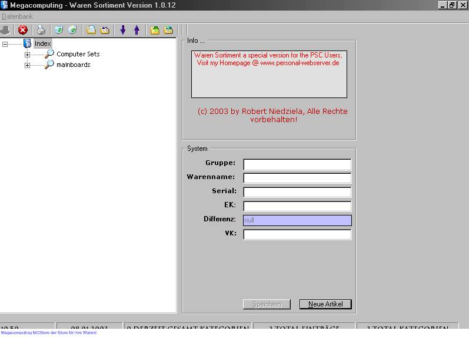



## DbStore \- The Store Base \*Updatet\*

### Description

Megacomputing - Waren Sortiment, enables yor Store your Sortiment, Computers Hardware etc in a database, with price EK _german buy price , and Sell price VK

it wars prog for my hardware store i need it

----

Updatet: Some bugs Fixed.
 
### More Info
 
name, price, etc :-)

sell price,

time

             |
---                |---
**Submitted On**   |2003-01-08 10:42:56
**By**             |[Robert N\.](https://github.com/Planet-Source-Code/PSCIndex/blob/master/ByAuthor/robert-n.md)
**Level**          |Intermediate
**User Rating**    |4.8 (19 globes from 4 users)
**Compatibility**  |VB 5\.0, VB 6\.0
**Category**       |[Databases/ Data Access/ DAO/ ADO](https://github.com/Planet-Source-Code/PSCIndex/blob/master/ByCategory/databases-data-access-dao-ado__1-6.md)
**World**          |[Visual Basic](https://github.com/Planet-Source-Code/PSCIndex/blob/master/ByWorld/visual-basic.md)
**Archive File**   |[DbStore\_\-\_152589182003\.zip](https://github.com/Planet-Source-Code/robert-n-dbstore-the-store-base-updatet__1-42268/archive/master.zip)

